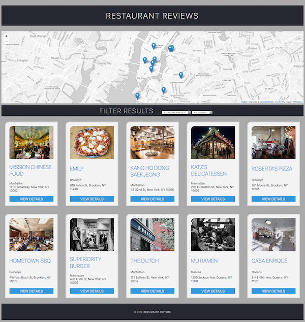

# README

<a href="https://www.udacity.com/">
  
</a>

[Udacity Google Mobile Web Specialist Nanodegree program](https://www.udacity.com/course/mobile-web-specialist-nanodegree--nd024)

[Project 1. Restaurant Reviews app](https://github.com/br3ndonland/udacity-google-mws)

Brendon Smith

[br3ndonland](https://github.com/br3ndonland)

[](https://choosealicense.com/)

[](https://github.com/standard/standard)

## Table of Contents <!-- omit in toc -->

- [Description](#description)
- [Repository contents](#repository-contents)
- [Projects](#projects)
  - [Project 1](#project-1)
  - [Project 2](#project-2)
  - [Project 3](#project-3)

## Description

This is a Progressive Web Application (PWA) that displays a list of restaurants and associated information. I completed this project for my [Udacity Google Mobile Web Specialist Nanodegree program](https://www.udacity.com/course/mobile-web-specialist-nanodegree--nd024).



I was awarded a scholarship to this Nanodegree program after completing the [Udacity Grow with Google](https://www.udacity.com/grow-with-google) Scholarship challenge course, in the Intermediate Web Developer track. Materials from the challenge course are available in my [udacity-google repo](https://github.com/br3ndonland/udacity-google).


## Repository contents

- [info/](info): Project documentation, reviews, and computational narratives.
- [lessons/](lessons): Lesson notes, divided into subdirectories for each part of the Nanodegree program.
- [src/](src): Application source files.
  - [assets](assets)
    - [css](assets/css)
      - [styles.css](assets/css/styles.css): Styles used in application. Features CSS Grid, variables ("custom properties"), and BEM (Block Element Modifier).
    - [img](assets/img): Images used in application.
    - [js](assets/js)
      - [dbhelper.js](assets/js/dbhelper.js): JavaScript class constructor with static methods to serve data to the app.
      - [index.js](assets/js/index.js): JavaScript for application homepage.
      - [restaurant.js](assets/js/restaurant.js): JavaScript for restaurant details page.
  - [data](data)
    - [restaurants.json](data/restaurants.json): Restaurant data in JSON format.
- [.babelrc](.babelrc): Configuration file for [Babel](https://babeljs.io/).
- [.eslintrc](.eslintrc): Configuration file for [ESLint](https://eslint.org/). I use [JavaScript Standard Style](https://standardjs.com/) with the [vscode extension](https://marketplace.visualstudio.com/items?itemName=chenxsan.vscode-standardjs). The ESLint file is used by [Codacy](https://www.codacy.com/) for continuous integration of code quality reviews.
- [.gitignore](.gitignore): Instructions to Git to exclude certain files from commits.
- [index.html](index.html): Application homepage.
- [restaurant.html](restaurant.html): Restaurant details page.
- [sw.js](sw.js): Service Worker for offline caching.
- [README.md](README.md): This file, a concise description of the repository.

## Projects

### Project 1

Project 1 had three parts:

1. **Responsive design**
2. **Accessibility features**
3. **Offline capability**

Run a local HTTP server to test the application. There are multiple pages, so it is helpful to run a server instead of directly opening the HTML in a browser.

  ```sh
  cd <PATH>
  python3 -m http.server 8000
  ```

Browse to [localhost:8000](http://localhost:8000) to see the app.

### Project 2

#### Data API

In project 2, we use a Node server to deliver the data API.

- Clone the [server repo](https://github.com/udacity/mws-restaurant-stage-2) into a separate directory.
- Start the data server:

  ```sh
  cd <PATH>
  npm i
  npm i sails -g
  node server
  ```

- Start the web server in the *src/* subdirectory.

  ```sh
  cd <PATH>/src
  python3 -m http.server 8000
  ```

- The app calls the data server on port `1337`.
- The data server actually fetches the data from the same place as before, *data/restaurants.json*, but it presents the data as an API instead of just a JSON file.
- Browse to [localhost:8000](http://localhost:8000) to see the app.

#### IndexedDB

- The app stores the JSON data in IndexedDB for offline access.

#### Performance

We were required to meet Lighthouse performance benchmarks for progressive web apps:

- **Performance** ≥70
- **Progressive Web App** ≥90
- **Accessibility** ≥90

My app's Lighthouse scores:

- **Performance** 94
- **PWA** 92
- **Accessibility** 100

### Project 3

#### Data API setup

We use a different Node server to deliver the data API.

- Clone the [project 3 server repo](https://github.com/udacity/mws-restaurant-stage-3) into a separate directory.
- Start the data server:

  ```sh
  cd <PATH>
  npm i
  npm i sails -g
  node server
  ```

#### Data API endpoints

- The app calls the data server on port `1337`.
- The data server presents a JSON API.

##### `GET`

- Get all restaurants: `http://localhost:1337/restaurants/`
- Get favorite restaurants: `http://localhost:1337/restaurants/?is_favorite=true`
- Get a restaurant by id: `http://localhost:1337/restaurants/<restaurant_id>`
- Get all reviews for a restaurant: `http://localhost:1337/reviews/?restaurant_id=<restaurant_id>`
- Get all restaurant reviews: `http://localhost:1337/reviews/`
  - Reviews are stored as JSON with the following format:

    ```json
    {
      "restaurant_id": <restaurant_id>,
      "name": <reviewer_name>,
      "rating": <rating>,
      "comments": <comment_text>
    }
    ```

- Get a restaurant review by id: `http://localhost:1337/reviews/<review_id>`
- Get all reviews for a restaurant: `http://localhost:1337/reviews/?restaurant_id=<restaurant_id>`

##### `POST`

- Create a new restaurant review: `http://localhost:1337/reviews/`
  - Reviews are stored as JSON with the following format:

    ```json
    {
      "restaurant_id": <restaurant_id>,
      "name": <reviewer_name>,
      "rating": <rating>,
      "comments": <comment_text>
    }
    ```

##### `PUT`

- Favorite a restaurant: `http://localhost:1337/restaurants/<restaurant_id>/?is_favorite=true`
- Un-favorite a restaurant: `http://localhost:1337/restaurants/<restaurant_id>/?is_favorite=false`
- Update a restaurant review: `http://localhost:1337/reviews/<review_id>`
  - Updated reviews have the following JSON format:

    ```json
    {
      "name": <reviewer_name>,
      "rating": <rating>,
      "comments": <comment_text>
    }
    ```

##### `DELETE`

- Delete reviews: `http://localhost:1337/reviews/<review_id>`

#### Web server

- Start the web server in the *src/* subdirectory.

  ```sh
  cd <PATH>/src
  python3 -m http.server 8000
  ```

- Browse to [localhost:8000](http://localhost:8000) to see the app.

#### Reviews

- This project adds review capabilities to the app.

#### Performance in project 3

We were required to meet Lighthouse performance benchmarks for progressive web apps:

- **Performance** ≥90
- **Progressive Web App** ≥90
- **Accessibility** ≥90

My app's Lighthouse scores:

- **Performance**
- **Progressive Web App**
- **Accessibility**