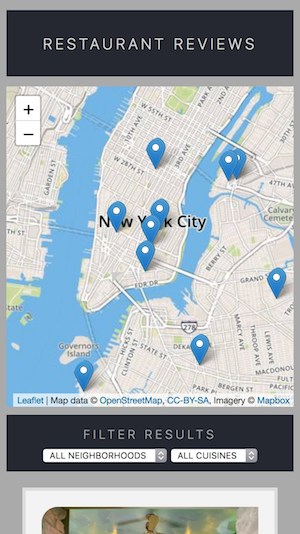
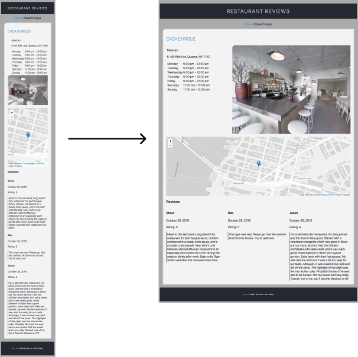

# Computational narrative

<a href="https://www.udacity.com/">
  
</a>

[Udacity Google Mobile Web Specialist Nanodegree program](https://www.udacity.com/course/mobile-web-specialist-nanodegree--nd024)

[Project 1. Restaurant Reviews app](https://github.com/br3ndonland/udacity-google-mws-p1)

Brendon Smith

[br3ndonland](https://github.com/br3ndonland)

## Table of Contents <!-- omit in toc -->

- [Getting started](#getting-started)
  - [Map](#map)
- [Responsive design](#responsive-design)
  - [Simple structure and styling](#simple-structure-and-styling)
  - [CSS Grid restaurant list](#css-grid-restaurant-list)
  - [Restaurant details page](#restaurant-details-page)
- [Accessibility](#accessibility)
- [Offline availability](#offline-availability)

## Getting started

- Forked and cloned the repo
- Created a `dev` branch
- Started a local HTTP server in the directory

  ```sh
  cd computing/udacity-google-mws-p1
  python3 -m http.server 8000
  ```

### Map

- Signed up for [Mapbox](https://www.mapbox.com).
- [Leaflet](https://leafletjs.com/).

## Responsive design

### Simple structure and styling

- I worked on one page at a time.
- I started by cleaning up the HTML structure.
- I organized the CSS and worked on some simple styling changes.
  - I added `border-top-left-radius: 1rem;` to `img` to achieve the rounded corner as shown in the mockup.
  - I modified some of the colors and text effects to match the header to the mockup, and style the header and footer consistently.
  - Here's how it's looking now:

    

- Git commit at this point: Style homepage header and footer 83fe5d7

### CSS Grid restaurant list

- I opted to use CSS Grid for layout and responsive design.
- I started with the [Wes Bos CSS grid course](https://cssgrid.io/).
- I also reviewed the [MDN CSS Layout Guide](https://developer.mozilla.org/en-US/docs/Learn/CSS/CSS_layout).
- I changed the restaurant list from an unordered list to a container div, then styled the container into a grid.
- I changed this line in *index.html*:

  ```html
  <ul id="restaurant-list"></ul>
  ```

- To this:

  ```html
  <div class="container" id="restaurant-list"></div>
  ```

- And then styled the container with CSS:

  ```css
  .container {
    display: grid;
    grid-template-columns: 1fr 1fr 1fr;
    grid-gap: 0.2rem;
    border: var(--border);
  }
  ```

- This results in a nice grid for the restaurants:

  

- Git commit: Add CSS Grid for homepage restaurants bd154fd
- Next, I made the restaurant grid responsive.
  - Use `auto-fill` and `minmax()` for responsive reflowing
  - Trim unneccessary CSS
  - Organize CSS, img, and JS in /assets
  - I considered formatting the entire page as a grid, with the restaurant list as a nested grid. I decided I didn't need to at this time, because the page is looking responsive.

  

- Git commit: Responsively reflow restaurant grid

### Restaurant details page

- After completing the homepage, I worked on the restaurant details page.
- I deleted most of the provided CSS.
- I organized the CSS with [BEM](https://css-tricks.com/bem-101/).
- I switched to the light map style with `id: mapbox.light`. I was also able to use moonlight with the direct URL to the style in my account, but stuck with light.
- I used nested grids to organize the page:
  - Info: I created a grid to display the restaurant info and image inline. I used `justify-items: end;` to spread each part of the grid out to the sides.
  - Reviews: I changed the review body to blockquote, and styled with italic.
- Responsive grids: It was difficult to get the info and reviews grids to reflow responsively. It wasn't as simple as using `auto-fill` and `minmax()` like I did on the homepage. Instead, I set the columns to `1fr` by default, and wrote a media query to scale on larger displays. I based the breakpoint on the [Bootstrap medium responsive breakpoint](https://getbootstrap.com/docs/4.1/layout/overview/#responsive-breakpoints).
- Screenshot of responsive restaurant details page (full page screenshots captured in Firefox Developer Edition, and assembled in Figma)

  

- I modified the JavaScript files to create divs instead of uls, and to add class names and alt text.

#### TODO

- [x] grid container
- [x] Center breadcrumb
- [x] MAP AT RIGHT ON DESKTOP, BELOW ON COLLAPSE
- [x] create three columns
- [x] use `fr` to lay out columns
- [x] Move both filter dropdowns onto same new row
- [x] Fix spacing in restaurant grid so the restaurants don't overlap
- [x] Rewrite `fillRestaurantsHTML` and `createRestaurantHTML` in *main.js* to create `div`s instead of `ul`/`li`?

## Accessibility

## Offline availability

[(Back to top)](#top)
