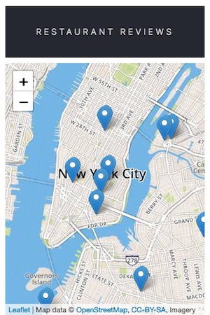

# Computational narrative

<a href="https://www.udacity.com/">
  
</a>

[Udacity Google Mobile Web Specialist Nanodegree program](https://www.udacity.com/course/mobile-web-specialist-nanodegree--nd024)

[Project 1. Restaurant Reviews app](https://github.com/br3ndonland/udacity-google-mws-p1)

Brendon Smith

[br3ndonland](https://github.com/br3ndonland)

## Table of Contents <!-- omit in toc -->

- [Getting started](#getting-started)
  - [Map](#map)
- [Responsive design](#responsive-design)
  - [Simple structure and styling](#simple-structure-and-styling)

## Getting started

- Forked and cloned the repo
- Created a `dev` branch
- Started a local HTTP server in the directory

  ```sh
  cd computing/udacity-google-mws-p1
  python3 -m http.server 8000
  ```

### Map

- Signed up for [Mapbox](https://www.mapbox.com).
- [Leaflet](https://leafletjs.com/).

## Responsive design

### Simple structure and styling

- I worked on one page at a time.
- I started by cleaning up the HTML structure.
- I organized the CSS and worked on some simple styling changes.
  - I added `border-top-left-radius: 1rem;` to `img` to achieve the rounded corner as shown in the mockup.
  - I modified some of the colors and text effects to match the header to the mockup, and style the header and footer consistently.
  - Here's how it's looking now:

    

[(Back to top)](#top)
