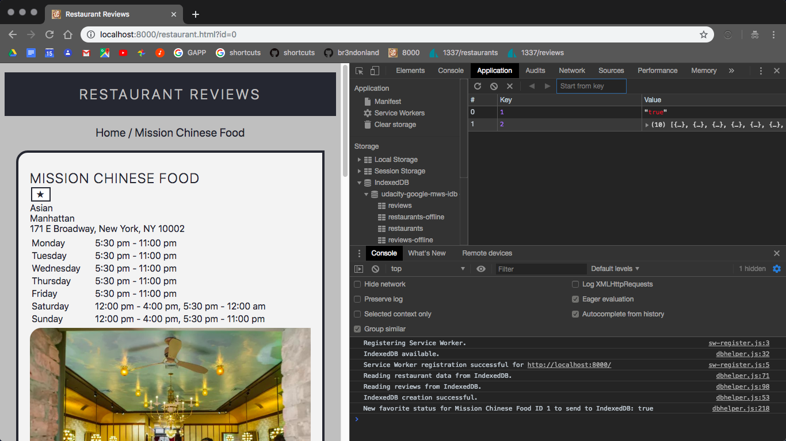
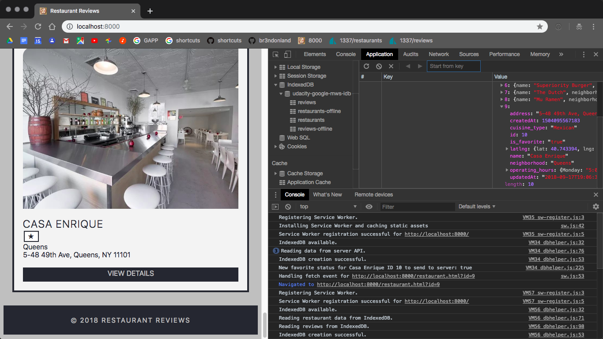
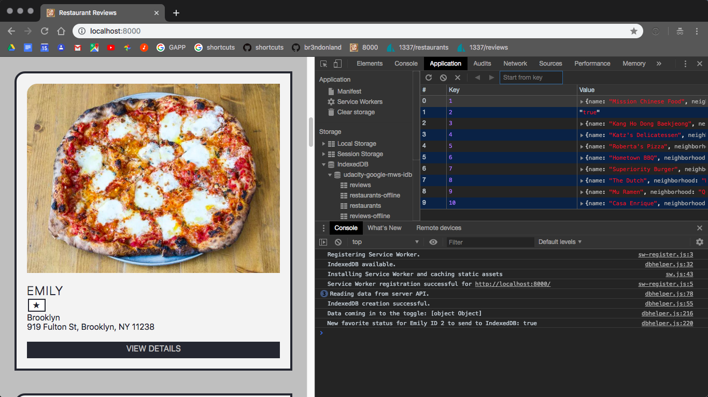
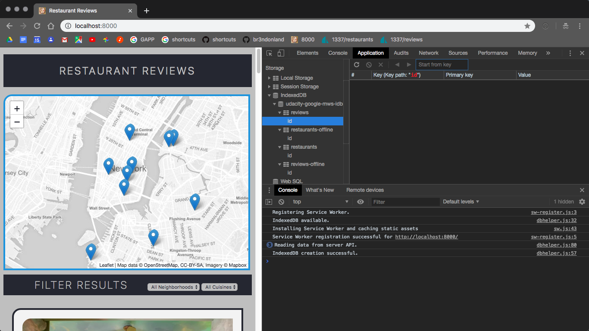
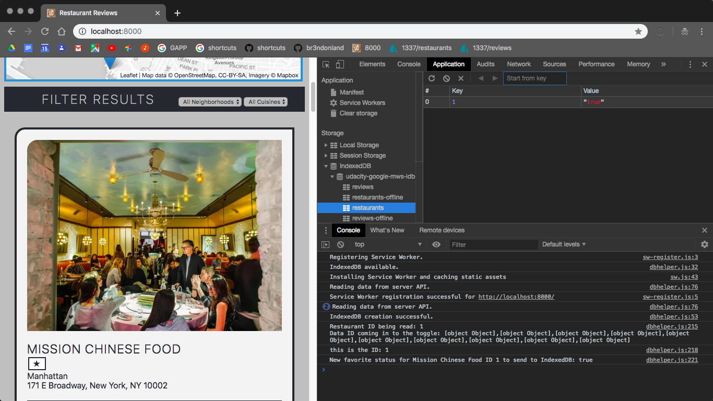

# Computational narrative

<a href="https://www.udacity.com/">
  
</a>

[Udacity Google Mobile Web Specialist Nanodegree program](https://www.udacity.com/course/mobile-web-specialist-nanodegree--nd024)

[Project 3. Restaurant Reviews app](https://github.com/br3ndonland/udacity-google-mws)

Brendon Smith

[br3ndonland](https://github.com/br3ndonland)

## Table of Contents <!-- omit in toc -->

- [Getting started](#getting-started)
- [Favorites](#favorites)
  - [Favorite button](#favorite-button)
  - [Favorite toggle](#favorite-toggle)
- [Reviews](#reviews)
  - [Fetch reviews from updated server API](#fetch-reviews-from-updated-server-api)
  - [Fetch reviews from IndexedDB](#fetch-reviews-from-indexeddb)
  - [User interface for adding reviews](#user-interface-for-adding-reviews)
  - [Review submission](#review-submission)
- [Performance](#performance)
- [Reflections](#reflections)

## Getting started

- Same strategy for the data server as in project 2, but it comes from a new repo.
- Cloned the [project 3 server repo](https://github.com/udacity/mws-restaurant-stage-3) into a separate directory.
- I watched the [Doug Brown project 3 walkthrough](https://www.youtube.com/watch?v=a7i0U1aCBok). Note Doug's use of [ternary conditional operators](https://en.wikipedia.org/wiki/%3F:) `?:`.

## Favorites

### Favorite button

- I created a favorite button with *index.js* in the `createRestaurantHTML()` function.
  - I used the HTML unicode character [white star `&#9734;`](https://unicode-table.com/en/2606/).
  - I included an if/then statement, in *dbhelper.js*, *index.js*, and *restaurant.js*, to change to the [black star `&#9733`](https://unicode-table.com/en/2605/) when the restaurant is favorited.

### Favorite toggle

#### Online

- Now that I have a favorite button, I need to use it to change the `is_favorite` value in the restaurant data. The project 3 data server provides a `PUT` endpoint at `http://localhost:1337/restaurants/<restaurant_id>/?is_favorite=true`.
- I started by creating a `toggleFavorite()` function in *dbhelper.js*, and getting it working over the network.
  - I set up a `fetch` query using the data server `PUT` endpoint. The `PUT` method updates the JSON data on the server. I used the [ternary conditional operators](https://en.wikipedia.org/wiki/%3F:) `?:`, as shown in the [Doug Brown project 3 walkthrough](https://www.youtube.com/watch?v=a7i0U1aCBok). The `?:` works like if/then, so if the restaurant JSON has `"is_favorite": "true",` the query will change it to `"is_favorite": "false",`.
  - Boolean vs. string: `true` and `false` can either be interpreted as Boolean (without quotes) or string (with quotes). See the [Doug Brown project 3 walkthrough](https://www.youtube.com/watch?v=a7i0U1aCBok) 0.15.00. I kept them as strings.
  - I included the same if/then statement from *index.js* and *restaurant.js* to change to the [black star `&#9733`](https://unicode-table.com/en/2605/) when the restaurant is favorited. I need it in all three files because I need to create the star when the page is rendered, and also change the star when the favorite status changes.
  - Here's how the online-only function looked initially:

    ```js
    static async toggleFavorite (restaurant) {
      try {
        const query = fetch(`${DBHelper.DATABASE_URL}/${restaurant.id}/?${restaurant.is_favorite === 'true' ? 'is_favorite=false' : 'is_favorite=true'}`, {method: 'PUT'})
        const response = await (await query).json()
        restaurant.is_favorite = response.is_favorite
        const favoriteButton = document.getElementById(`restaurant-${restaurant.id}`)
        console.log(`This is restaurant ID ${restaurant.id}`)
        if (restaurant.is_favorite === 'true') {
          favoriteButton.innerHTML = '&#9733'
          favoriteButton.setAttribute('aria-label', `Remove ${restaurant.name} from favorites`)
        } else {
          favoriteButton.innerHTML = '&#9734'
          favoriteButton.setAttribute('aria-label', `Add ${restaurant.name} to favorites`)
        }
        console.log(`Favorite status for ${restaurant.name}: ${restaurant.is_favorite}`)
      } catch (e) {
        throw Error(e)
      }
    }
    ```

#### Offline

##### IndexedDB confusion

<details><summary>Details of my struggles with IndexedDB</summary>

- After adding a click listener on the favorite icon, I worked on the `DBHelper.toggleFavorite(restaurant)` function. This was the challenging part.
  - I started by grabbing the appropriate element with `document.getElementById(`restaurant-${restaurant.id}`)`.
  - Next, I had to read the info from IDB. I was having two issues, shown in the image below:
    
      1. *Overwriting the JSON array in IndexedDB:* At first, I was reading the database with `store.getAll()`. The problem with this was that submitting a change in favorite status (like "true" or "false") was just overwriting the entire JSON object store. Rather than calling `store.getAll()`, I had to call `store.openCursor(0[restaurant.id])` to iterate through the JSON and read the object for this specific restaurant. There's just one JSON array for all the restaurants, so I use `0`, and I want to change the favorite status for this specific restaurant, so I use `restaurant.id` to find its object in the JSON array. Also note my use of Async/Await to read the data returned from IndexedDB.
      2. *Duplicating the JSON array in IndexedDB:* The second problem you can see in the image above is that I was duplicating the JSON array every time I loaded the page.
          1. I had to change the object store key path in `DBHelper.createDatabase()` from `{autoincrement: true}` to `{keyPath: 'id'}`. Also see [MDN IndexedDB keyPath vs. autoincrement](https://developer.mozilla.org/en-US/docs/Web/API/IndexedDB_API/Using_IndexedDB#Structuring_the_database).
          2. This was throwing some errors at first. Each time I open the object store, I have to reference the specific key path. I only have one JSON array, and keys start at 1. Each time I act on the object store, I need to add the `keyPath`, like `await restaurantsStore.put(restaurants, 1)`.
  - I also included an `else {}` condition to attempt to send changes directly to server API if IndexedDB is not present, basically functioning like a normal online web app in that case.
- Here's the `DBHelper.toggleFavorite(restaurant)` function at this point for reference:

  ```js
  // Static method to toggle favorite status of a restaurant by clicking the star button
  static async toggleFavorite (restaurant) {
    try {
      const favoriteButton = document.getElementById(`restaurant-${restaurant.id}`)
      // Look for IndexedDB and open JSON object with cursor
      const db = await idb.open('udacity-google-mws-idb', 1)
      const tx = db.transaction('restaurants', 'readwrite')
      const store = tx.objectStore('restaurants')
      const data = await store.openCursor(0[restaurant.id])
      if (data.length > 0) {
        // If IndexedDB is present, send data there
        restaurant.is_favorite = data.is_favorite === 'true' ? 'false' : 'true'
        console.log(`New favorite status for ${restaurant.name} ID ${restaurant.id} to send to IndexedDB: ${restaurant.is_favorite}`)
        await store.put(restaurant.is_favorite, 1)
        // TODO: POST to IDB restaurants-offline object store
      } else {
        // If IndexedDB is not present, attempt to send changes directly to server API
        const query = fetch(`${DBHelper.DATABASE_URL}/${restaurant.id}/?${restaurant.is_favorite === 'true' ? 'is_favorite=false' : 'is_favorite=true'}`, {method: 'PUT'})
        const response = await (await query).json()
        restaurant.is_favorite = response.is_favorite
        console.log(`New favorite status for ${restaurant.name} ID ${restaurant.id} to send to server: ${restaurant.is_favorite}`)
      }
      // Change icon
      if (restaurant.is_favorite === 'true') {
        favoriteButton.innerHTML = '&#9733'
        favoriteButton.setAttribute('aria-label', `Remove ${restaurant.name} from favorites`)
      } else {
        favoriteButton.innerHTML = '&#9734'
        favoriteButton.setAttribute('aria-label', `Add ${restaurant.name} to favorites`)
      }
    } catch (e) {
      throw Error(e)
    }
  }
  ```

- At this point, I thought IndexedDB was updating properly:
  
- There were some bugs lurking though.
  - *It didn't work offline.* I was testing this online when I thought it worked.
    - I found that `data.length > 0` would only work with `store.getAll()`. Using `store.get()` or `store.openCursor()` would actually not return `> 0`. As a result, the `DBHelper.toggleFavorite()` function would go to the `else` condition in the function, changing the value *on the server* instead of in IndexedDB.
    - I noticed that it would take a refresh to see the updated value. This was because IndexedDB was being overwritten with the new value from the JSON server. Thus, instead of going to IndexedDB like I thought, it was going to the server, which was then updating IndexedDB after a refresh or navigation to a new page. Changing `data.length > 0` to just `data` works though.
    - The need for a page refresh may be a Service Worker issue also. I'm not sure if I need to solve this to complete the project. My fellow scholar Josh Ethridge passed the project, and you can see this issue in his [`DBHelper.createFavoriteButton(restaurant)` function](https://github.com/jethridge13/mws-restaurant/blob/master/js/dbhelper.js).
  - *I was still overwriting the entire JSON array in IndexedDB.* When I corrected the function to actually change IndexedDB, I still had the same problem as before. It's just overwriting the entire array instead of finding the specific value it needs to update.
    - If I break up the JSON array by restaurant, as shown below, I still have the same problem. I do create individual database keys for each JSON object in the array, but when updating one, I just overwrite the entire thing.

      ```js
      // dbhelper.js
      // createDatabase() function
      // Store restaurant JSON in IndexedDB
      const restaurantsQuery = fetch(DBHelper.DATABASE_URL)
      const restaurants = await (await restaurantsQuery).json()
      restaurants.forEach(async restaurant => {
        const restaurantsTx = db.transaction('restaurants', 'readwrite')
        const restaurantsStore = restaurantsTx.objectStore('restaurants')
        await restaurantsStore.put(restaurant, restaurant.id)
      })
      ```

      
- On the [MDN IndexedDB keyPath vs. autoincrement](https://developer.mozilla.org/en-US/docs/Web/API/IndexedDB_API/Using_IndexedDB#Structuring_the_database) page, they also mention that you can create an index.
  - I tried creating an index, but it didn't seem to be the answer I needed. I wrote some code like this:

    ```js
    // Create IndexedDB
    const db = await idb.open('udacity-google-mws-idb', 1, upgradeDb => {
      const restaurants = upgradeDb.createObjectStore('restaurants', {keypath: 'id'})
      restaurants.createIndex('id', 'id', {unique: true})
      let index = restaurants.index('id')
      index.get('1').onsuccess = event => alert(`this is the index: ${event.target.result.id}`)
      const restaurantsOffline = upgradeDb.createObjectStore('restaurants-offline', {keypath: 'id'})
      restaurantsOffline.createIndex('id', 'id', {unique: true})
      const reviews = upgradeDb.createObjectStore('reviews', {keypath: 'id'})
      reviews.createIndex('id', 'id', {unique: true})
      const reviewsOffline = upgradeDb.createObjectStore('reviews-offline', {keypath: 'id'})
      reviewsOffline.createIndex('id', 'id', {unique: true})
      // upgradeDb.createObjectStore('pending', {autoIncrement: true})
    })
    ...
    ```

  - It basically just added sub-tables to the database.
    
- After my index fail, I went back to where I was before, overwriting the JSON array each time.
    
- I sometimes get this error:

  ```text
  dbhelper.js:237 Uncaught (in promise) Error: DataError: Failed to execute 'put' on 'IDBObjectStore': The object store uses out-of-line keys and has no key generator and the key parameter was not provided.
    at Function.toggleFavorite
  ```

- Talk about an opaque error message.
- I still think the answer lies in a cursor. I should open a cursor, then call `cursor.update()`.
- I worked with a cursor for a while. I opened a cursor at the object for the appropriate restaurant, using the `restaurant.id`, but I was still overwriting the entire object store.

  ```js
  // dbhelper.js
  // Opening a cursor at the restaurant ID
  static async toggleFavorite (restaurant) {
    try {
      const favoriteButton = document.getElementById(`restaurant-${restaurant.id}`)
      if ('indexedDB' in window) {
        console.log(`Restaurant ${restaurant.name} ID ${restaurant.id} selected.`)
        const db = await idb.open('udacity-google-mws-idb', 1)
        const tx = db.transaction('restaurants', 'readwrite')
        const store = tx.objectStore('restaurants')
        const data = await store.openCursor(restaurant.id)
        console.log(`Store gotten is for the restaurant ${data.value.name}.`)
        const newStatus = data.value.is_favorite === 'true' ? 'false' : 'true'
        await data.update(newStatus, 'is_favorite')
        restaurant.is_favorite = newStatus
        console.log(`New favorite status for ${restaurant.name} ID ${restaurant.id} to send to IndexedDB: ${newStatus}`)
      } else {
        // If IndexedDB is not present, attempt to POST changes directly to server API
        const query = fetch(`${DBHelper.DATABASE_URL}/${restaurant.id}/?${restaurant.is_favorite === 'true' ? 'is_favorite=false' : 'is_favorite=true'}`, {method: 'PUT'})
        // Fetch data from server with new favorite status
        const response = await (await query).json()
        restaurant.is_favorite = response.is_favorite
        console.log(`New favorite status for ${restaurant.name} ID ${restaurant.id} on server: ${restaurant.is_favorite}`)
      }
      // Change icon
      if (restaurant.is_favorite === 'true') {
        favoriteButton.innerHTML = '&#9733'
        favoriteButton.setAttribute('aria-label', `Remove ${restaurant.name} from favorites`)
      } else {
        favoriteButton.innerHTML = '&#9734'
        favoriteButton.setAttribute('aria-label', `Add ${restaurant.name} to favorites`)
      }
    } catch (e) {
      throw Error(e)
    }
  }

  ```

- This was equivalent to

  ```js
  static async toggleFavorite (restaurant) {
    try {
      const favoriteButton = document.getElementById(`restaurant-${restaurant.id}`)
      if ('indexedDB' in window) {
        console.log(`Restaurant ${restaurant.name} ID ${restaurant.id} selected.`)
        const db = await idb.open('udacity-google-mws-idb', 1)
        const tx = db.transaction('restaurants', 'readwrite')
        const store = tx.objectStore('restaurants')
        const data = await store.getAll()
        console.log(`Store gotten is for the restaurant ${data.name}.`)
        const newStatus = data.is_favorite === 'true' ? 'false' : 'true'
        await store.put(newStatus, restaurant.id)
        restaurant.is_favorite = newStatus
        console.log(`New favorite status for ${restaurant.name} ID ${restaurant.id} to send to IndexedDB: ${newStatus}`)
      } else {
        // If IndexedDB is not present, attempt to POST changes directly to server API
        const query = fetch(`${DBHelper.DATABASE_URL}/${restaurant.id}/?${restaurant.is_favorite === 'true' ? 'is_favorite=false' : 'is_favorite=true'}`, {method: 'PUT'})
        // Fetch data from server with new favorite status
        const response = await (await query).json()
        restaurant.is_favorite = response.is_favorite
        console.log(`New favorite status for ${restaurant.name} ID ${restaurant.id} on server: ${restaurant.is_favorite}`)
      }
      // Change icon
      if (restaurant.is_favorite === 'true') {
        favoriteButton.innerHTML = '&#9733'
        favoriteButton.setAttribute('aria-label', `Remove ${restaurant.name} from favorites`)
      } else {
        favoriteButton.innerHTML = '&#9734'
        favoriteButton.setAttribute('aria-label', `Add ${restaurant.name} to favorites`)
      }
    } catch (e) {
      throw Error(e)
    }
  }

  ```

</details>

#### IndexedDB confusion resolution

- **Database architecture:** I had to spend some time reading about IndexedDB and re-thinking my data model.
  - I created an **object store** for the restaurant data, and another for the reviews.
  - The data at `http://localhost:1337/restaurants` is an array of JSON objects. It is possible to store the entire JSON array as one entry in the database object store `restaurants`, but in order to make database operations easier, I split the JSON array up with one database entry per restaurant JSON object. This is an array, so I am able to use `items.forEach(item =>{})` to iterate over the array and store each JSON object as a database entry.
  - Here's the updated `DBHelper.createDatabase()` static method:

    ```js
    // dbhelper.js
    static async createDatabase () {
      try {
        if ('indexedDB' in window) {
          // Create IndexedDB
          const db = await idb.open('udacity-google-mws-idb', 1, upgradeDb => {
            upgradeDb.createObjectStore('restaurants', {keypath: 'id'})
            upgradeDb.createObjectStore('reviews', {keypath: 'id'})
          })
          // Store restaurant JSON in IndexedDB
          const restaurantsQuery = fetch(DBHelper.DATABASE_URL)
          const restaurants = await (await restaurantsQuery).json()
          restaurants.forEach(async restaurant => {
            const tx = db.transaction('restaurants', 'readwrite')
            const store = tx.objectStore('restaurants')
            await store.put(restaurant, restaurant.id)
          })
          // Store reviews JSON in IndexedDB
          const reviewsQuery = fetch(DBHelper.DATABASE_URL_REVIEWS)
          const reviews = await (await reviewsQuery).json()
          reviews.forEach(async review => {
            const tx = db.transaction('reviews', 'readwrite')
            const store = tx.objectStore('reviews')
            await store.put(review, review.id)
          })
        } else {
          console.warn('IndexedDB not available.')
        }
      } catch (e) {
        throw Error(e)
      }
    }
    ```

- **Database transactions:** Now that the database and object stores have been created, a **cursor** is needed in order to iterate over the object store and identify a specific entry.
  - The [MDN IDBCursor example page](https://developer.mozilla.org/en-US/docs/Web/API/IDBCursor#Example) and [source code on GitHub](https://github.com/mdn/indexeddb-examples/blob/master/idbcursor/scripts/main.js) are helpful. They feature a list of albums from my favorite rock band, Rush. Note the use of an **index** in the MDN example. An **index** ([Google](https://developers.google.com/web/ilt/pwa/working-with-indexeddb#working_with_ranges_and_indexes) | [MDN](https://developer.mozilla.org/en-US/docs/Web/API/IDBIndex)) is a way to reference a database entry by a property other than the primary key. Although the MDN example creates an index, it is not used in the `updateResult()` function, so I decided not to create an index at this point.
  - I was able to open a cursor for a specific restaurant with

    ```js
    const db = await idb.open('udacity-google-mws-idb', 1)
    const tx = db.transaction('restaurants', 'readwrite')
    const store = tx.objectStore('restaurants')
    const cursor = await store.openCursor(restaurant.id)
    ```

  - Cursors store data in `cursor.value`.
  - Next, I need to update `cursor.value.is_favorite`.
    - This step was difficult for me. I kept overwriting the entire database entry (the entire JSON object for the restaurant), instead of just changing the `is_favorite` attribute.
    - After several days of frustration, I realized that the syntax I was using was causing the problem. I was toggling favorite status with the [ternary conditional operator syntax](https://en.wikipedia.org/wiki/%3F:) `?:` from the [Doug Brown project 3 walkthrough](https://www.youtube.com/watch?v=a7i0U1aCBok). This syntax requires creation of a new object, like `const newStatus = cursor.value.is_favorite === 'true' ? 'false' : 'true'`, bu then updating the cursor with the new object `newStatus` just overwrites the entire cursor with `"true"`. Simply writing `cursor.value.is_favorite === 'true' ? 'false' : 'true'` throws an error. I tried modifying the `cursor.update()` command to be more specific, but it didn't work. I also tried including all the data in the `newStatus` object, but wasn't having success.
    - Success came when I got rid of the ternary conditional operator and used a traditional if/else statement instead. This allowed me to work directly with `cursor.value`, and update  `cursor.value.is_favorite` specifically.
  - Here's the updated `DBHelper.toggleFavorite()` static method at this point:

    ```js
    // dbhelper.js
    static async toggleFavorite (restaurant) {
      try {
        const favoriteButton = document.getElementById(`restaurant-${restaurant.id}`)
        if ('indexedDB' in window) {
          const db = await idb.open('udacity-google-mws-idb', 1)
          const tx = db.transaction('restaurants', 'readwrite')
          const store = tx.objectStore('restaurants')
          const cursor = await store.openCursor(restaurant.id)
          if (cursor.value.is_favorite === 'true') {
            cursor.value.is_favorite = 'false'
          } else {
            cursor.value.is_favorite = 'true'
          }
          await cursor.update(cursor.value)
          restaurant.is_favorite = cursor.value.is_favorite
        } else {
          // If IndexedDB is not present, attempt to POST changes directly to server API
          const query = fetch(`${DBHelper.DATABASE_URL}/${restaurant.id}/?${restaurant.is_favorite === 'true' ? 'is_favorite=false' : 'is_favorite=true'}`, {method: 'PUT'})
          // Fetch data from server with new favorite status
          const response = await (await query).json()
          restaurant.is_favorite = response.is_favorite
          console.log(`New favorite status for ${restaurant.name} ID ${restaurant.id} on server: ${restaurant.is_favorite}`)
        }
        // Change icon
        if (restaurant.is_favorite === 'true') {
          favoriteButton.innerHTML = '&#9733'
          favoriteButton.setAttribute('aria-label', `Remove ${restaurant.name} from favorites`)
        } else {
          favoriteButton.innerHTML = '&#9734'
          favoriteButton.setAttribute('aria-label', `Add ${restaurant.name} to favorites`)
        }
      } catch (e) {
        throw Error(e)
      }
    }

    ```

**What a ridiculous amount of work just to edit JSON.** IndexedDB should be more JSON-friendly. Note that the MDN IndexedDB page doesn't even mention JSON, when it is the number one use case for REST endpoints on the web.

#### Caching map tiles

- I also noticed I wasn't properly caching map tiles. This is a very common problem.
  - Leaflet doesn't provide good ways to cache map tiles or create a static map.
  - Mapbox does offer a [static map](https://www.mapbox.com/help/static-api-playground/), but if it's added through the leaflet tile option it gets repeated instead of showing a single image. Also note that if you use the `L.tilelayer({errorTileUrl: ''})` option, it will attempt to fetch the markers from there as well.
- I addressed this issue by also creating static maps. *TODO*

#### Syncing offline favorites with server

- There are a couple of things I need to sync here. First, when I toggle a favorite on the homepage, it does change, but if I then navigate to the restaurant page, the favorite doesn't show up. I have to refresh the page to show the update. This may be a Service Worker issue.
- Next, I need to create a queue for changes made when offline, and propagate the queue to the server when connectivity is re-established.
- *TODO*

## Reviews

### Fetch reviews from updated server API

- When I revisited *restaurant.html*, I refactored some of *restaurant.html* to look closer to *index.html* by moving more of the HTML generation to *restaurant.js*. I updated the CSS accordingly.
- In project 2, the reviews were appended to the restaurant JSON. In project 3, the reviews are in a separate JSON API.
  - I set up a reviews variable in *dbhelper.js*:

    ```js
    static get DATABASE_URL_REVIEWS () {
      const port = 1337
      return `http://localhost:${port}/reviews`
    }
    ```

  - I updated `DBHelper.createDatabase()` to fetch the reviews and put them into a separate IDB store. I'm not using the new IDB store yet, but I will get to it.
- Next, when rendering the restaurant info page *restaurant.html*, I needed to fetch reviews specific to that restaurant.
  - It was confusing and frustrating to figure this out. I had to spend several hours hacking and console logging, trying to sort through the Udacity [callback hell](https://www.quora.com/What-is-callback-hell).  The way Udacity wrote the code is non-linear and difficult to read. I considered refactoring the entire codebase, but decided it wouldn't be worth the effort at this point. I eventually had some success.
  - I started at `restaurant.fetchRestaurantFromURL()`, which calls `DBHelper.fetchRestaurantById()`, which calls `DBHelper.fetchRestaurants()`.
  - Within the call to `DBHelper.fetchRestaurants()` I added `self.restaurant.reviews = restaurant.reviews`, which will read reviews returned from the function and plug into the rest of the previously written code in *restaurant.js*.
  - This means I need to pull review data into the `DBHelper.fetchRestaurants()` function. I decided to just work with the online data API itself right now, because trying to add in IDB calls at the same time would be too complicated. As a side benefit, I was finally able to delete the line with `==`. StandardJS prefers `===` over `==`, but when I tried to add `===` previously it was breaking the function. I was simply able to slice the array by `id`. The array is zero-indexed, but restaurant IDs start at 1. Subtract 1 to read array properly.

    ```js
    // dbhelper.js
    // Static method to fetch restaurant by ID
    static fetchRestaurantById (id, callback) {
      DBHelper.fetchRestaurants(async (error, restaurants) => {
        if (error) {
          callback(error, null)
        } else {
          // const restaurant = restaurants.find(r => r.id == id)
          const restaurant = restaurants[id - 1]
          // Fetch reviews by ID
          const query = fetch(DBHelper.DATABASE_URL_REVIEWS)
          const response = await (await query).json()
          const reviews = response.filter(review => review.restaurant_id === restaurant.id)
          restaurant.reviews = reviews
          if (restaurant) {
            callback(null, restaurant)
          } else {
            callback(null, 'Restaurant does not exist')
          }
        }
      })
    }
    ```

  - I could also update `urlForRestaurant()`, but then the ID you would see in the URL doesn't match the restaurant.

    ```js
    static urlForRestaurant (restaurant) {
      const correctedId = restaurant.id - 1
      return (`./restaurant.html?id=${correctedId}`)
    }
    ```

### Fetch reviews from IndexedDB

- Next, I needed to fetch reviews from IndexedDB if available.
  - This was much easier and only took me a few minutes.
  - I considered making a separate `fetchReviews()` function, or adding the reviews fetch to `fetchRestaurants()`, but the callbacks make it too difficult.
  - I ended up just nesting the reviews fetch under `fetchRestaurantById()`.
  - The function in *dbhelper.js* looked like this:

    ```js
    // dbhelper.js
    // Static method to fetch restaurant by ID
    static fetchRestaurantById (id, callback) {
      DBHelper.fetchRestaurants(async (error, restaurants) => {
        if (error) {
          callback(error, null)
        } else {
          const restaurant = restaurants[id]
          // Fetch reviews by ID from IDB if present, else fetch from server API
          const db = await idb.open('udacity-google-mws-idb', 1)
          const tx = db.transaction('reviews', 'readonly')
          const store = tx.objectStore('reviews')
          const data = await store.getAll()
          if (data.length > 0) {
            let response = data[0]
            console.log('Reading reviews from IndexedDB.')
            const reviews = response.filter(review => review.restaurant_id === restaurant.id)
            restaurant.reviews = reviews
          } else {
            const query = fetch(DBHelper.DATABASE_URL_REVIEWS)
            let response = await (await query).json()
            console.log('Reading reviews from server API.')
            const reviews = response.filter(review => review.restaurant_id === restaurant.id)
            restaurant.reviews = reviews
          }
          if (restaurant) {
            callback(null, restaurant)
          } else {
            callback(null, 'Restaurant does not exist')
          }
        }
      })
    }
    ```

### User interface for adding reviews

- I created an overlay for adding reviews.
- I added `<form class="overlay d-none" id="overlay-div"></form>` to *restaurant.html* as a placeholder, and programmatically created the HTML from within *restaurant.js*.
- I show and hide the overlay by using a function to toggle `d-none` when the `addReview` link in the header is clicked:

  ```js
  addReview.addEventListener('click', () => overlayDiv.classList.toggle('d-none'))
  ```

### Review submission

- To get started, I reviewed the [MDN sending form data](https://developer.mozilla.org/en-US/docs/Learn/HTML/Forms/Sending_and_retrieving_form_data) page.
- The review submission process starts on the restaurant page and in *restaurant.js*. The `saveReview()` function collects metadata for the `POST` request, but does not yet submit the `POST` request, and then triggers the `DBHelper.saveReview()` function.
- After submitting the form, the page was reloading to `http://localhost:8000/restaurant.html?`.
  - Problem with *restaurant.js* `fetchRestaurantFromURL()`.

## Performance

My app was already meeting the performance benchmarks during project 2.
          }
        }
      })
    }
    ```

### User interface for adding reviews

- I created an overlay for adding reviews.
- I added `<form class="overlay d-none" id="overlay-div"></form>` to *restaurant.html* as a placeholder, and programmatically created the HTML from within *restaurant.js*.
- I show and hide the overlay by using a function to toggle `d-none` when the `addReview` link in the header is clicked:

  ```js
  addReview.addEventListener('click', () => overlayDiv.classList.toggle('d-none'))
  ```

### Review submission

- To get started, I reviewed the [MDN sending form data](https://developer.mozilla.org/en-US/docs/Learn/HTML/Forms/Sending_and_retrieving_form_data) page.
- The review submission process starts on the restaurant page and in *restaurant.js*. The `saveReview()` function collects metadata for the `POST` request, but does not yet submit the `POST` request, and then triggers the `DBHelper.saveReview()` function.
- After submitting the form, the page was reloading to `http://localhost:8000/restaurant.html?`.
  - Problem with *restaurant.js* `fetchRestaurantFromURL()`.

## Performance

My app was already meeting the performance benchmarks during project 2.

## Reflections

- It's difficult to debug with all the caching.
- Working with IndexedDB was utter torture. In particular, it makes storing and working with JSON unnecessarily difficult. It's like the worst aspects of databases, and the worst aspects of browsers, together in one API.